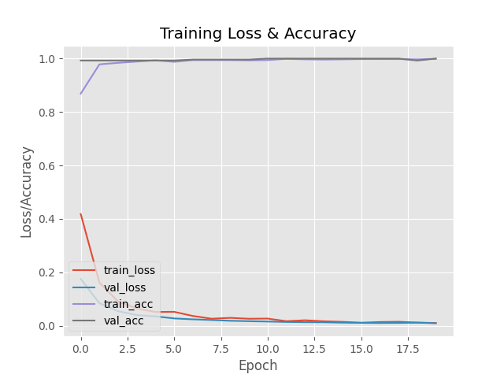

# Simple Face-Mask Detector
A Simple Face-Mask Detector built with **OpenCV**, **Keras(Tensorflow)** in order to detect face masks in both images and video streams. 

<table>
    <tr>
    <td style='text-align:center;'>
         <b> Sample Detections of Multiple Faces with Masks </b>
    </td>
    </tr>
</table>

### TechStack/Framework
- OpenCV
- Keras(Tensorflow)
- MobileNetV2
    - Optimizer: Adam
    - Loss: Binary Crossentropy
    - Metrics: Accuracy
- Caffe-based Face Detector

### Dataset
The dataset was created by Prajna Bhandary. 
The dataset consists of 1,376 images belongs to two classes: 

- with_mask: 690 images 
- without_mask: 686 images 

The images used were real images of human faces, however artificial face masks were added to create an artificial (but still real-world applicable) dataset.

### Prerequisties
All the dependencies and required libraries are included in the file `requirements.txt`(TBC).

### Results
The model gave 98% accuracy for Face Mask Detection after training. 
See also in the following accuracy/loss training curve plot:

### Working
1. To train the Face-Mask Detector, execute the following sample command:
   `python train_detector.py -d Dataset`
2. To detect face masks in an single image, execute the following sample command:
   `python predict_image.py -i .\Examples\Images\image-01.jpg`
3. To detect face masks in video streams, execute the following sample command:
   `python predict_video.py`

### Inspiration
This simplified, hello-world like project for a greenhand in Computer vision is inspired by the efforts of **Adrian Rosebrock** and **Prajna Bhandary**.

### Special Thanks to...
Thanks for my awesome guys, **Xiyu L.** and **Feng J.** who helped me to test my tiny project and record the lovely gif in the front of this page.

### Lisence

MIT © [Ch'i YU](https://github.com/Ch-i-Yu)